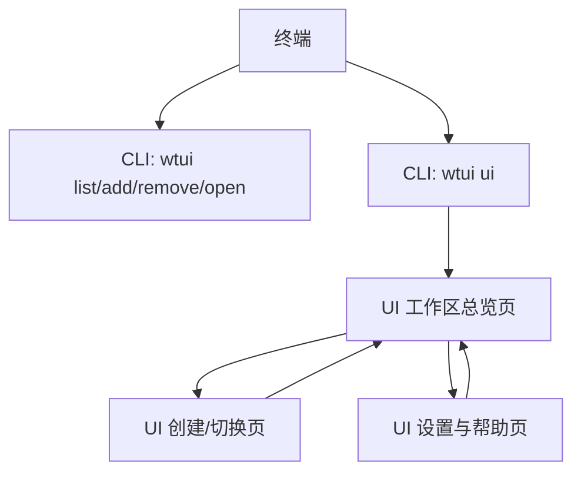

## 1. Product Overview
wtui 是一个用于管理 git worktree 的本地工具，提供 CLI 与可选的 Web UI。
它帮助你更快创建/切换/清理 worktree，并用 UI 可视化当前仓库的多工作区状态。

## 2. Core Features

### 2.1 Feature Module
wtui 的核心交互由以下页面/入口组成：
1. **CLI 命令行**：列出 worktrees、创建/删除 worktree、进入工作目录、启动 UI、查看帮助。
2. **UI 工作区总览页**：展示当前仓库 worktree 列表与状态；提供常用快捷操作。
3. **UI 创建/切换页**：创建新 worktree、选择分支/提交、校验目标路径。
4. **UI 设置与帮助页**：配置默认参数（如 baseDir、editor/open 命令）；展示命令速查与故障排查。

### 2.2 Page Details
| Page Name | Module Name | Feature description |
|-----------|-------------|---------------------|
| CLI 命令行 | Repo 识别与上下文 | 自动识别当前目录所属 git 仓库；允许通过参数指定 repo 路径；在非仓库目录给出可操作提示。 |
| CLI 命令行 | Worktree 列表（`wtui list`） | 输出 worktree 列表（路径、分支/HEAD、是否被锁定、是否为主工作区）；支持可读/JSON 两种输出以便脚本使用。 |
| CLI 命令行 | 创建 worktree（`wtui add`） | 通过分支/新分支/指定提交创建 worktree；目标目录可指定或按规则生成；若目录冲突/分支不存在则给出明确错误。 |
| CLI 命令行 | 移除 worktree（`wtui remove`） | 按路径或名称移除 worktree；在存在未提交改动时要求显式确认/强制参数。 |
| CLI 命令行 | 打开/进入（`wtui open`） | 在系统文件管理器或编辑器中打开某个 worktree（按配置的 open/editor 命令）；支持仅打印路径以便 `cd $(wtui path ...)`。 |
| CLI 命令行 | 启动 UI（`wtui ui`） | 启动本地 UI 服务并在浏览器打开；控制端口（自动/指定）；退出时关闭本地服务；提供“只打印 URL 不自动打开”的选项。 |
| CLI 命令行 | 配置与帮助（`wtui config/help`） | 读取/写入本地配置（如默认 baseDir、打开命令）；输出命令用法与示例。 |
| UI 工作区总览页 | Worktree 列表 | 以表格/卡片展示 worktree：名称/路径、分支/HEAD、最近活动（可选）、状态标记（锁定/脏工作区）。 |
| UI 工作区总览页 | 快捷操作 | 对单个 worktree 执行：打开、复制路径、删除（含二次确认）；对当前 repo 执行：刷新列表。 |
| UI 创建/切换页 | 创建表单 | 选择来源（现有分支/新分支/提交）；输入目标目录与名称；提交前做基本校验并展示将执行的 git 命令摘要。 |
| UI 创建/切换页 | 执行与反馈 | 提交后展示进度与结果；失败时展示可复制的错误信息与建议（如分支不存在、路径冲突）。 |
| UI 设置与帮助页 | 配置面板 | 设置 baseDir、默认命名规则（可选）、open/editor 命令；保存后立即生效；提供恢复默认值。 |
| UI 设置与帮助页 | 命令速查 | 展示 CLI 常用命令与示例；说明 `wtui ui` 的启动/关闭方式与端口规则。 |

## 3. Core Process
**日常 CLI 流程**：你在仓库目录运行 `wtui list` 查看所有 worktree；用 `wtui add <branch>` 创建新的 worktree；用 `wtui open <name|path>` 直接在编辑器或文件管理器打开；不需要时用 `wtui remove <name|path>` 清理。

**UI 启动与使用流程**：你运行 `wtui ui`；wtui 先校验当前目录为 git 仓库并解析 worktree 列表，然后启动一个本地 HTTP 服务（提供 worktree 管理 API + 托管前端静态资源），最后自动打开浏览器进入总览页。你在 UI 上执行创建/删除/打开等操作时，前端调用本地 API，CLI 层执行对应 git 命令并返回结果，UI 及时展示成功/失败信息。

