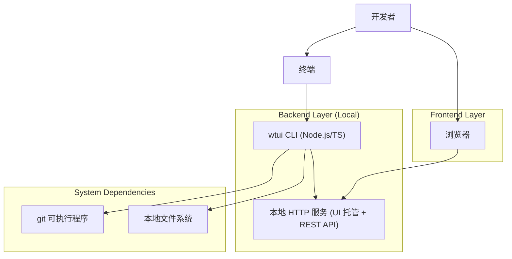
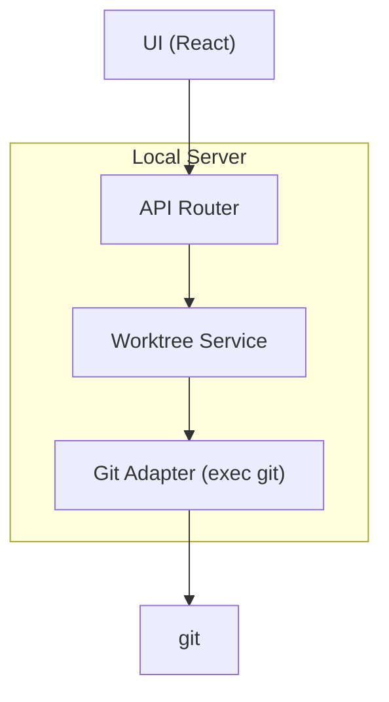

## 1.Architecture design



## 2.Technology Description

* Frontend: React\@18 + Vite + TypeScript + TailwindCSS

* Backend: Node.js CLI（TypeScript）+ 本地 HTTP Server（用于托管 UI 与提供 API）

* Git 交互: 调用系统 `git`（通过进程执行）

* Database: None（数据直接来自 `git worktree list --porcelain` 等命令输出）

## 3.Route definitions

| Route     | Purpose                           |
| --------- | --------------------------------- |
| /         | UI 工作区总览：列表与快捷操作                  |
| /create   | UI 创建/切换：创建 worktree 表单与执行结果      |
| /settings | UI 设置：baseDir、open/editor 命令、行为选项 |
| /help     | UI 帮助：命令速查与常见问题                   |

## 4.API definitions (If it includes backend services)

### 4.1 Shared TypeScript types

```ts
export type RepoInfo = {
  rootPath: string;      // 仓库根目录
  gitDirPath: string;    // .git 目录（或工作树指向）
};

export type WorktreeItem = {
  id: string;            // 可用 path 规范化后生成
  path: string;
  head: string;          // commit hash
  branch?: string;       // refs/heads/xxx（若存在）
  isMain: boolean;
  isLocked: boolean;
  hasChanges?: boolean;  // 可选：通过 git status 快速判断
};

export type CreateWorktreeRequest = {
  ref: string;           // 分支名或提交
  newBranch?: string;    // 若创建新分支
  path: string;          // 目标目录
};

export type ApiResult<T> = {
  ok: boolean;
  data?: T;
  error?: { code: string; message: string; details?: string };
};
```

### 4.2 Core API

* 获取仓库信息

  * `GET /api/repo` -> `ApiResult<RepoInfo>`

* 获取 worktree 列表

  * `GET /api/worktrees` -> `ApiResult<WorktreeItem[]>`

* 创建 worktree

  * `POST /api/worktrees`

  * Body: `CreateWorktreeRequest`

  * Response: `ApiResult<WorktreeItem>`

* 删除 worktree

  * `DELETE /api/worktrees/:id` -> `ApiResult<{ removed: true }>`

* 打开 worktree（调用系统 open/editor）

  * `POST /api/worktrees/:id/open` -> `ApiResult<{ launched: true }>`

### 4.3 UI 启动链路（`wtui ui`）

1. CLI 校验 repo（当前目录或 `--repo`）。
2. CLI 启动本地 HTTP 服务：

   * 静态资源：托管 Vite 构建产物（`dist/`）。

   * API：提供 `/api/*`，执行 git 命令并返回结构化结果。
3. CLI 输出 URL，并按参数决定是否自动打开浏览器。
4. UI 通过同源请求调用 API（无需额外鉴权，默认仅绑定 `127.0.0.1`）。

## 5.Server architecture diagram (If it includes backend services)



## 6.Data model(if applicable)

本产品不
